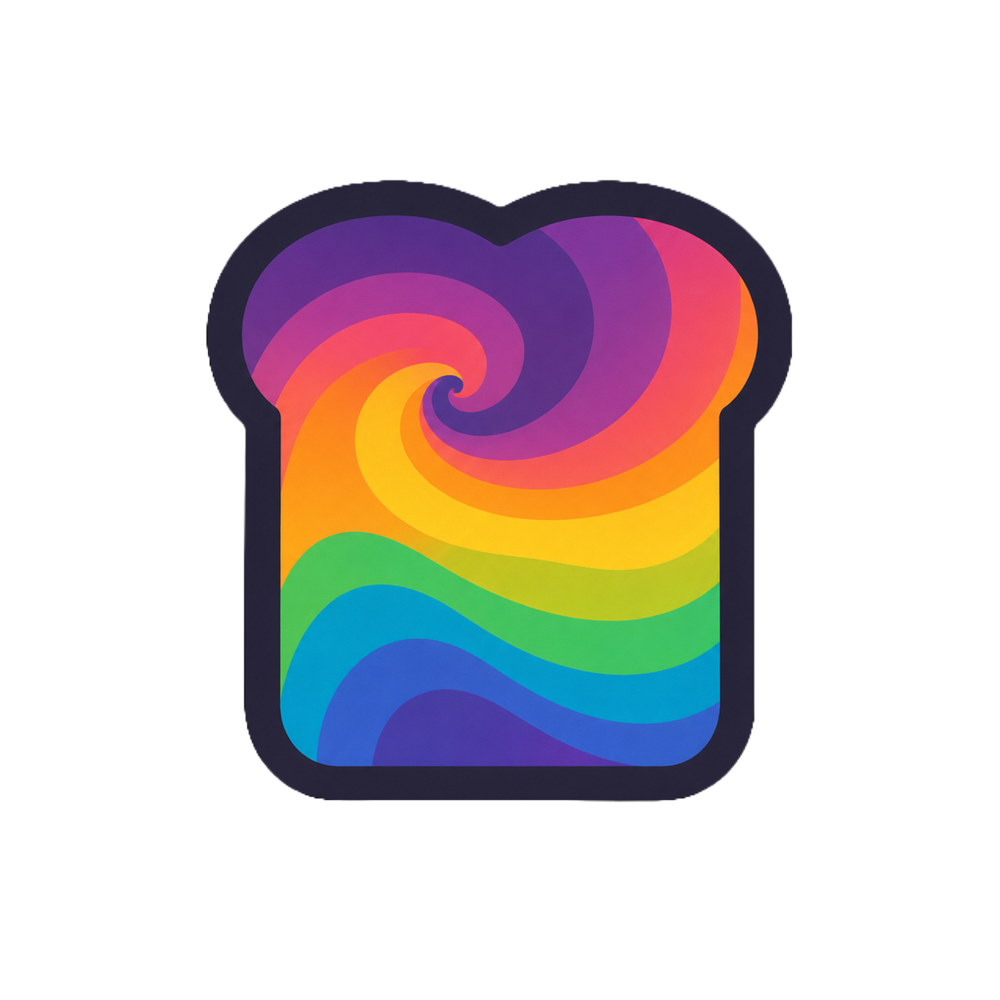
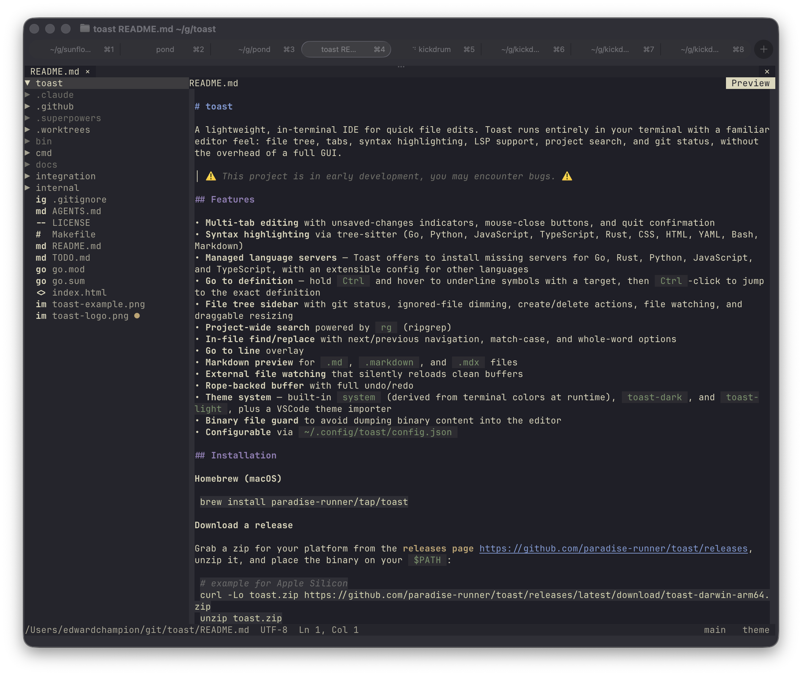

<div align="center">

<h1>


# toast

</h1>
</div>


A lightweight, in-terminal IDE for quick file edits. Toast runs entirely in your terminal with a familiar editor feel: file tree, tabs, syntax highlighting, LSP support, project search, and git status, without the overhead of a full GUI.

> ⚠️ This project is in _very early development_, proceed with caution as you may encounter bugs. ⚠️ 




## Features

- **Multi-tab editing** with unsaved-changes indicators
- **Syntax highlighting** via tree-sitter (Go, Python, JavaScript, TypeScript, Rust, CSS, HTML, YAML, Bash, Markdown)
- **LSP integration** — completions, hover docs, and go-to-definition out of the box
- **File tree sidebar** with git status, create/delete actions, and file watching
- **Project-wide search** powered by `rg` (ripgrep)
- **Markdown preview** for `.md` and `.markdown` files
- **Rope-backed buffer** with full undo/redo
- **Theme system** — built-in `system`, dark, and light themes, plus a VSCode theme importer
- **Configurable** via `~/.config/toast/config.json`

## Installation

**Homebrew (macOS)**

```bash
brew install paradise-runner/tap/toast
```

**Download a release**

Grab a zip for your platform from the [releases page](https://github.com/paradise-runner/toast/releases), unzip it, and place the binary on your `$PATH`:

```bash
# example for Apple Silicon
curl -Lo toast.zip https://github.com/paradise-runner/toast/releases/latest/download/toast-darwin-arm64.zip
unzip toast.zip
install -m755 toast-darwin-arm64 /usr/local/bin/toast
```

**Build from source**

Requires Go 1.25.2+.

```bash
git clone https://github.com/paradise-runner/toast
cd toast
make build
# binary written to bin/toast
```

## Usage

```bash
toast               # open current directory
toast path/to/dir   # open a specific directory
toast path/to/file  # open a file (auto-detects git root)
toast new/file.go   # open a new file buffer if the parent directory exists
toast --help
toast --version
```

`rg` is required for project search. Language servers such as `gopls`, `pyright-langserver`, `typescript-language-server`, and `rust-analyzer` are optional and enable LSP features when installed.

## Keybindings

| Key | Action |
|-----|--------|
| `Ctrl+Q` | Quit |
| `Ctrl+S` / `Cmd+S` | Save |
| `Ctrl+W` / `Cmd+W` | Close tab |
| `Ctrl+Tab` | Next tab |
| `Ctrl+Shift+Tab` | Previous tab |
| `Ctrl+B` | Toggle sidebar |
| `Ctrl+Shift+E` | Toggle focus between editor and file tree |
| `Ctrl+Shift+F` | Search |
| `Ctrl+G` / `Cmd+L` | Go to line |
| `Ctrl+Shift+M` | Toggle Markdown preview |
| `Ctrl+Z` / `Cmd+Z` | Undo |
| `Ctrl+Y` / `Ctrl+Shift+Z` / `Cmd+Y` / `Cmd+Shift+Z` | Redo |
| `Ctrl+Space` / `Cmd+Space` | Trigger completion |
| `Ctrl+Shift+K` | Show hover |
| `F12` | Go to definition |

File-tree create/delete actions and theme selection are currently driven from the UI: right-click in the sidebar for file operations, and use the `theme` button in the status bar to open the theme picker.

## Configuration

Toast reads `~/.config/toast/config.json` on startup. Missing keys fall back to defaults.

```json
{
  "theme": "toast-dark",
  "editor": {
    "tab_width": 4,
    "word_wrap": false,
    "show_whitespace": false,
    "auto_indent": true,
    "trim_trailing_whitespace_on_save": true,
    "insert_final_newline_on_save": true
  },
  "sidebar": {
    "visible": true,
    "width": 30,
    "confirm_delete": true
  },
  "lsp": {
    "go":         { "command": "gopls",                       "args": ["serve"] },
    "python":     { "command": "pyright-langserver",          "args": ["--stdio"] },
    "typescript": { "command": "typescript-language-server",  "args": ["--stdio"] },
    "rust":       { "command": "rust-analyzer",               "args": [] }
  },
  "search": {
    "command": "rg",
    "args": ["--json"]
  },
  "ignored_patterns": [".git", "node_modules", "__pycache__", ".DS_Store"]
}
```

### Themes

Built-in themes: `system`, `toast-dark`, `toast-light`. Custom themes live in `~/.config/toast/themes/`.

**Import a VSCode theme:**

```bash
toast migrate-theme vscode path/to/theme.json
# writes ~/.config/toast/themes/<theme-name>.json
```

Then set `"theme": "<theme-name>"` in your config.

## Feedback & Issues

Found a bug or have a feature request? We'd love to hear from you! Please open an [issue on GitHub](https://github.com/paradise-runner/toast/issues) with as much detail as possible. Your feedback helps make Toast better.

## Development

```bash
make build             # compile
make run               # go run ./cmd/toast .
make test              # go test ./...
make test-integration  # run opt-in Ghostty/tmux terminal integration tests
```

### Integration Tests

The integration test suite launches Toast inside a temporary Ghostty window
attached to an isolated tmux server, drives it with `tmux send-keys`, and writes
pane captures plus PNG screenshots to a temporary artifact directory.

Requirements:

- macOS
- Ghostty installed at `/Applications/Ghostty.app` or set `TOAST_GHOSTTY_APP`
  to the app path
- `tmux`
- `screencapture`

Before running the screenshot tests, enable Ghostty in:

```text
System Settings > Privacy & Security > Screen & System Audio Recording
```

Run the integration tests with:

```bash
make test-integration
```

By default, artifacts are written to a temporary directory and the path is
printed in the verbose test output. Set `TOAST_TERMINAL_ARTIFACT_DIR` to keep
artifacts in a specific directory.
